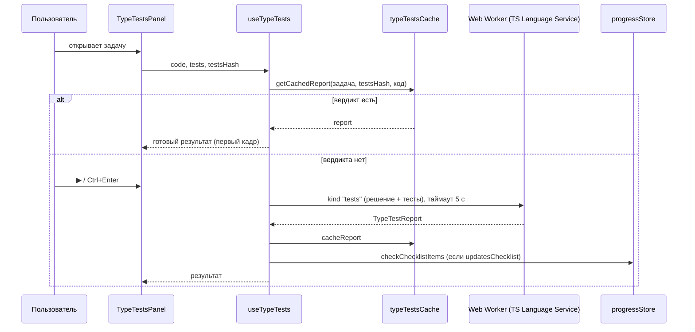

# Тесты типов в разделе TypeScript

Фича заменяет консоль в TypeScript-задачах панелью тестов. Решение проверяет
компилятор: платформа собирает код пользователя и заранее подготовленные тесты в
один невидимый модуль, прогоняет его через TypeScript Language Service в Web Worker
и показывает результат по каждому требованию задачи.

## 1. Контекст и цели

### Проблема

В разделе 54 задачи в 7 группах. Большинство из них проверяют **типы**, а не
поведение, а консоль показывает только результат выполнения кода. После
транспиляции типы стёрты, поэтому критерии вида «`api.random("10")` должен быть
ошибкой компиляции» консоль проверить не может. В итоге:

- у задачи нет критерия «решено», пользователь сверяется с эталоном глазами;
- пункт чек-листа «без `any` и подавляющих директив» проверялся только вручную;
- пустая заглушка `type X = unknown` компилируется без ошибок, хотя задача не решена.

### Цели

1. Дать объективный, воспроизводимый критерий «требование выполнено» для каждой задачи.
2. Объяснять причину провала на уровне типов: «Ожидалось / Получено», «Ожидалась ошибка типа».
3. Не менять процесс обучения: статус «решена» по-прежнему ставит пользователь.
4. Не добавлять зависимостей и не нагружать основной поток.

### Вне границ

Рантайм-тесты, скрытые тесты, автоматический запрет `any` / `@ts-ignore`, живой прогон
при наборе, автоматическое изменение статуса задачи и интервального повторения,
история попыток и статистика, тесты для разделов JavaScript, React и Algorithms.

## 2. Глоссарий

| Термин                   | Значение                                                                                                                    |
| ------------------------ | --------------------------------------------------------------------------------------------------------------------------- |
| Тест (case)              | Один вызов `test("имя", () => { … })` в файле тестов задачи. Читается как требование к решению.                             |
| Файл тестов              | `curriculum/typescript/tests/<группа>/<задача>.ts`; в приложении лежит в `Task.rawTests`. Пользователю код не показывается. |
| Прелюдия                 | Хелперы `Equal`, `Expect`, `Prettify`, `test`, `describe`. Существуют только в виртуальном документе проверки.              |
| Склейка                  | Виртуальный файл `/__type-tests__.ts`: прелюдия + решение + тесты в одной области видимости.                                |
| Кейс «компилируется»     | Автоматический первый случай: в файле решения нет ошибок компиляции. Учитывается в счёте.                                   |
| Отчёт (`TypeTestReport`) | Результат одного прогона: кейс компиляции, статусы тестов, счётчики, длительность.                                          |
| Устаревший результат     | Код решения изменился после прогона, по которому построен отчёт.                                                            |
| Эталон                   | Reference-решение задачи (вкладка «Решение»).                                                                               |

## 3. Как работает проверка

### Виды проверок

| Вид               | Как пишется                                         | Когда тест проходит                                       |
| ----------------- | --------------------------------------------------- | --------------------------------------------------------- |
| Компиляция (авто) | Генерируется платформой                             | В решении нет диагностик уровня `error`                   |
| Позитивный        | `Expect<Equal<A, B>>` или присваивание с аннотацией | В диапазоне теста нет ошибок                              |
| Негативный        | `// @ts-expect-error` над строкой-нарушителем       | Строка действительно даёт ошибку (иначе TS 2578 «Unused») |

`Equal` — строгая реализация из type-challenges: различает `any`, `unknown`, `readonly`
и необязательность, поэтому решение «всё через `any`» тесты не проходит. Код тестов
**не выполняется**, он только типизируется.

### Склейка и защита целостности проверки

```
[прелюдия: Equal, Expect, Prettify, test, describe]
\n
[код решения как есть]
\n;\n
[файл тестов как есть]
```

Все три сегмента живут в одной области видимости модуля, поэтому тесты видят
объявления решения (`api`, `combine`), а ни решение, ни тесты не требуют `export`.
Защита устроена самой конструкцией документа, а не правилами стиля:

| Угроза                                                       | Защита                                                                                                                        |
| ------------------------------------------------------------ | ----------------------------------------------------------------------------------------------------------------------------- |
| `// @ts-nocheck` в решении «выключает» проверку всей склейки | Прелюдия идёт **первой**: файловая прагма действует только в начале файла. Кейс «компилируется» падает: «удалите @ts-nocheck» |
| Синтаксическая ошибка «съедает» последующие сегменты         | Тесты не прогоняются: кейс «компилируется» падает, остальные получают статус `skipped` и считаются непройденными              |
| Решение объявляет `test`, `Equal` и т. п.                    | Кейс «компилируется» падает: «Имя … зарезервировано тестами» (`RESERVED_TEST_NAMES`); тесты `skipped`                         |
| Незавершённая последняя инструкция решения                   | Разделитель `\n;\n` исключает слияние с первой инструкцией тестов                                                             |
| Ошибки типов внутри решения                                  | Диагностики сегмента решения при разборе склейки **игнорируются**; кейс «компилируется» считается по настоящему файлу         |

### Классификация диагностик склейки

Каждая диагностика уровня `error` сопоставляется с исходным сегментом (`mapToSource`):

1. сегмент **решения** — игнорируется (его проверяет кейс «компилируется»);
2. сегмент **тестов**, попадает в диапазон `test()` — тест `failed`; учитывается только
   первая диагностика теста;
3. вне любого `test()` или в прелюдии — «файл тестов повреждён» (`fileError`), ошибка
   контента, а не решения.

Тип причины определяет, что увидит пользователь:

| Код TS                        | Тип провала      | Что показывается                                                    |
| ----------------------------- | ---------------- | ------------------------------------------------------------------- |
| 2344 в аргументе `Equal<A,B>` | `mismatch`       | Два блока «Ожидалось» / «Получено» (`typeToString` без усечения)    |
| 2578                          | `expected-error` | «Ожидалась ошибка типа, но код скомпилировался» + строка-нарушитель |
| прочие                        | `diagnostic`     | Сообщение компилятора `TS<код>: …`                                  |

## 4. Пользовательские сценарии

### UC-1. Первый заход в задачу (вкладка «Задача»)

1. Пользователь открывает TypeScript-задачу, под редактором — панель «Тесты». По умолчанию она свёрнута
   (общая настройка `consoleCollapsed`).
2. Раскрывает панель: видит полный список требований серым и подсказку «Нажмите «Запустить»».
3. Пишет решение, нажимает кнопку запуска или `Ctrl/⌘ + Enter`. Панель при этом временно раскрывается.
4. Видит результат: ✓ / ✗ у каждого требования, сегментированный прогресс, счётчик `(2/4)`.
   Первый упавший случай раскрыт с объяснением.
5. При ошибке компиляции клик по ней в списке выделяет место в редакторе.
6. После двух неудачных запусков подряд (с изменённым кодом) один раз предлагается открыть подсказку.
7. При 100% появляется баннер «Все тесты пройдены · 0,3 с» с действиями: «Отметить решённой», «Посмотреть эталон»,
   «Следующая задача →».

### UC-2. Возврат к задаче и обновление страницы

Если страница открыта с тем же кодом, который уже проверялся, панель сразу рисуется в итоговом виде
без повторной проверки (см. [раздел 7](#7-кэш-результатов)).

### UC-3. Эталон (вкладка «Решение»)

Панель работает в режиме «только проверка»: эталон проверяется один раз при открытии вкладки,
чек-лист не отмечается, нудж и «Отметить решённой» не показываются. Эталон редактируемый,
после правок результат становится устаревшим, а запуск доступен вручную.

### UC-4. Отдельное окно (`/open/typescript/:taskId`)

Та же панель. Для режима «Задача» ведёт себя как в UC-1, но вместо «Отметить решённой» / «Следующая задача»
в баннере кнопка «Вернуться к задаче»; нудж к подсказкам не показывается (блока подсказок нет).

### UC-5. Сброс решения

Сброс кода к стартовому очищает результаты (состояние «не запускались»).

## 5. Функциональные требования

### 5.1. Запуск

| №    | Требование                                                                                                                                                                   |
| ---- | ---------------------------------------------------------------------------------------------------------------------------------------------------------------------------- |
| FR-1 | Запуск по кнопке `▶` в шапке панели и по `Ctrl/⌘ + Enter` в редакторе. Это единственный способ проверки пользовательского кода.                                              |
| FR-2 | Пока идёт прогон, кнопка заблокирована, на ней спиннер; повторный запуск игнорируется.                                                                                       |
| FR-3 | Спиннеры в строках списка появляются только если прогон длится дольше 150 мс (без мерцания на быстрых проверках).                                                            |
| FR-4 | Автоматическая проверка один раз: эталон на вкладке «Решение» и в отдельном окне в режиме эталона. После правок результат становится устаревшим, но не перезапускается.      |
| FR-5 | Прогон ограничен 5 с. По таймауту воркер пересоздаётся, показывается «Проверка заняла слишком много времени…» и кнопка «Повторить».                                          |
| FR-6 | Если воркер недоступен (нет `Worker`, CSP, сбои), показывается «Не удалось проверить решение» + «Повторить»; остальной интерфейс работает.                                   |
| FR-7 | Изменение кода после прогона помечает результат устаревшим: список приглушается, над ним строка «Код изменён — результаты устарели» + «Запустить», баннер успеха скрывается. |

### 5.2. Список и результат

| №     | Требование                                                                                                                                                                                                                                        |
| ----- | ------------------------------------------------------------------------------------------------------------------------------------------------------------------------------------------------------------------------------------------------- |
| FR-8  | До первого запуска показывается полный список требований (первый — «Решение компилируется без ошибок») серым, список берётся из лёгкого разбора `parseTestOutline`, без TypeScript в основном бандле.                                             |
| FR-9  | Тесты группируются по `describe`; тесты вне группы стоят на верхнем уровне. Названия и группы выводятся как inline-код: латинские идентификаторы (`getUserName`, `id`, `user.id`, `fn()`) и фрагменты в обратных кавычках подсвечиваются.         |
| FR-10 | Статусы: ожидает / идёт проверка / пройден / провален / не проверен (`skipped`). Статус дублируется текстом для скринридера, а не только иконкой и цветом.                                                                                        |
| FR-11 | Первый упавший случай раскрывается автоматически (кейс «компилируется» идёт первым). Остальные раскрываются по клику.                                                                                                                             |
| FR-12 | Кейс «компилируется» при провале показывает до 5 ошибок в формате `строка:колонка — сообщение`, далее «и ещё N». Клик по ошибке выделяет её в решении. При синтаксической ошибке, `@ts-nocheck` или зарезервированном имени показывается причина. |
| FR-13 | Если файл тестов повреждён, показывается «Ошибка в тестах задачи» со ссылкой «Сообщить» (GitHub Issues с предзаполненным названием задачи, версией приложения, хешем тестов и описанием; код пользователя в ссылку **не** передаётся).            |

### 5.3. Шапка панели

| №     | Требование                                                                                                                                                                                                                                                                                  |
| ----- | ------------------------------------------------------------------------------------------------------------------------------------------------------------------------------------------------------------------------------------------------------------------------------------------- |
| FR-14 | Шапка по виду совпадает с шапкой консоли: иконка списка (зелёная), заголовок «Тесты», счётчик, зелёная кнопка запуска, кнопки размера шрифта, кнопка сворачивания.                                                                                                                          |
| FR-15 | Счётчик в скобках и без контейнера: после запуска `(пройдено/не пройдено)`, где первое число зелёное, второе красное (`(2/4)`); при 100% только зелёное число (`(6)`); до запуска — общее число тестов серым. «Не пройдено» = всего − пройдено, включая пропущенные и кейс «компилируется». |
| FR-16 | Для скринридера счётчик озвучивается как «Пройдено N, не пройдено M»; итог прогона объявляется через `aria-live="polite"` («Пройдено N из M»).                                                                                                                                              |
| FR-17 | Размер текста панели: 11–20 px (по умолчанию 12 px, как в подсказках), кнопки «Уменьшить / Увеличить шрифт» с тултипом текущего размера; на границах кнопка отключена. Выбор сохраняется.                                                                                                   |
| FR-18 | Сворачивание: настройка общая с консолью (`consoleCollapsed`), по умолчанию панель свёрнута. Запуск, начатый пользователем, временно раскрывает свёрнутую панель, не меняя настройку; автоматический запуск не раскрывает. Раскрытие привязано к задаче.                                    |

### 5.4. Прогресс-бар

| №     | Требование                                                                                                                                                                   |
| ----- | ---------------------------------------------------------------------------------------------------------------------------------------------------------------------------- |
| FR-19 | Бар разделён на сегменты по числу строк списка (кейс «компилируется» + тесты). Зелёный — пройден, красный — провален, серый — ещё не проверен или пропущен.                  |
| FR-20 | Бар закреплён наверху прокручиваемой области (`position: sticky`), список прокручивается под ним, под баром есть отступ. Место под бар зарезервировано и до первого запуска. |

### 5.5. Баннер успеха и дальнейшие шаги

| №     | Требование                                                                                                                                                                                                                                                                                      |
| ----- | ----------------------------------------------------------------------------------------------------------------------------------------------------------------------------------------------------------------------------------------------------------------------------------------------- |
| FR-21 | Баннер «Все тесты пройдены · {время}» показывается, пока последний прогон прошёл 100% и код не менялся. Он плавно появляется только если его создал запуск; при повторном монтировании (смена вкладки, раскрытие панели, обновление страницы) показывается сразу.                               |
| FR-22 | Действия: «Отметить решённой» (только если задача не решена и не исключена), «Посмотреть эталон» (переключает вкладку), «Следующая задача →» (скрыта на последней), «Вернуться к задаче» (только в отдельном окне). Отметка статуса — **ручное** действие; тесты статус не меняют.              |
| FR-23 | После двух неудачных запусков подряд (код между ними менялся; повтор того же кода не считается) один раз за сессию задачи показывается «Застряли? Откройте подсказку». Кнопка прокручивает к блоку подсказок и фокусирует его; крестик закрывает нудж. Только в режиме «Задача» вкладки задачи. |

### 5.6. Связь с чек-листом

| №     | Требование                                                                                                                                                                                                                                   |
| ----- | -------------------------------------------------------------------------------------------------------------------------------------------------------------------------------------------------------------------------------------------- |
| FR-24 | Пункт чек-листа может быть привязан к именам тестов (`linked(текст, ...имена)`). После **запуска**, где все привязанные тесты прошли, пункт отмечается автоматически. Имя, общее для нескольких тестов, учитывается, только если прошли все. |
| FR-25 | Отметка односторонняя и идемпотентная (`checkChecklistItems`): тесты никогда не снимают галочку, повторный прогон ничего не ломает. Для эталона и при восстановлении из кэша отметки не ставятся.                                            |
| FR-26 | У привязанных пунктов бейдж «авто» с тултипом, перечисляющим имена тестов.                                                                                                                                                                   |

## 6. Состояния панели

| Состояние                   | Условие                                         | Что видно                                                                                                            |
| --------------------------- | ----------------------------------------------- | -------------------------------------------------------------------------------------------------------------------- |
| Не запускались              | Нет отчёта, фаза `idle`                         | Серый список требований, серый бар, счётчик — число тестов. Подсказка «Нажмите «Запустить»» только в режиме «Задача» |
| Идёт прогон                 | Фаза `running`                                  | Кнопка заблокирована; спиннеры в строках после 150 мс                                                                |
| Результат                   | Отчёт есть, код не менялся                      | ✓/✗, цветной бар, счётчик, первый упавший раскрыт                                                                    |
| Успех                       | 100%, нет `fileError`, код не менялся           | Баннер + действия                                                                                                    |
| Не проверено                | Синтаксическая ошибка или зарезервированное имя | Кейс «компилируется» ✗, остальные `skipped` с пояснением                                                             |
| Устарело                    | Код изменён после прогона                       | Приглушённый список, строка «Код изменён…» + «Запустить», баннер скрыт                                               |
| Таймаут / движок недоступен | Фаза `timeout` / `unavailable`                  | Предупреждение + «Повторить»                                                                                         |
| Файл тестов повреждён       | `fileError ≠ null`                              | Ошибка контента + «Сообщить»                                                                                         |
| Свёрнута                    | `consoleCollapsed` и нет ручного запуска        | Видна только шапка                                                                                                   |

## 7. Кэш результатов

Вердикт — чистая функция от кода решения и версии тестов, поэтому его можно
запоминать. Это убирает мигание при обновлении страницы (серый счётчик → зелёный,
появление бара и баннера, сдвиг содержимого).

| Параметр       | Значение                                                                                                                                                                                            |
| -------------- | --------------------------------------------------------------------------------------------------------------------------------------------------------------------------------------------------- |
| Хранилище      | `localStorage`, ключ `playground_type_tests_cache`; в памяти — `Map`, загружается один раз                                                                                                          |
| Ключ записи    | `версия кэша : taskId : хеш тестов : длина кода : FNV-1a(код)`                                                                                                                                      |
| Размер         | 40 последних записей (вытесняются самые старые)                                                                                                                                                     |
| Что кэшируется | Только успешно полученные отчёты без `fileError`                                                                                                                                                    |
| Поведение      | Совпадение при монтировании или смене кода восстанавливает состояние в первом кадре, автозапуск пропускается; восстановление не считается новой неудачной попыткой для нуджа и не отмечает чек-лист |
| Инвалидация    | Изменение кода или тестов (хеш в ключе); смена вердиктов проверяющего кода — ручным повышением `CACHE_VERSION`                                                                                      |
| Ошибки         | Повреждённый или переполненный `localStorage` просто означает пустой кэш                                                                                                                            |

## 8. Данные и контракты

### Поля задачи (`entities/task`)

| Поле             | Назначение                                                                  |
| ---------------- | --------------------------------------------------------------------------- |
| `rawTests`       | Исходник файла тестов (`?raw`, лежит в чанке раздела TypeScript)            |
| `testsHash`      | FNV-1a от `rawTests`; ключ кэша и содержимое сообщения о повреждённом тесте |
| `checklistTests` | `Record<индекс пункта, имена тестов>` для авто-отметки чек-листа            |

### Отчёт

```ts
interface TypeTestReport {
  compile: {
    passed: boolean;
    problems: EditorDiagnostic[];
    reason: "errors" | "syntax" | "nocheck" | "reserved" | null;
    message: string | null;
  };
  results: {
    case: TypeTestCase;
    status: "passed" | "failed" | "skipped";
    failure: TypeTestFailure | null;
  }[];
  fileError: string | null; // файл тестов повреждён
  passed: number; // включая кейс «компилируется»
  total: number;
  durationMs: number;
}
type TypeTestFailure =
  | { kind: "mismatch"; expected: string; actual: string; message: string }
  | { kind: "expected-error"; snippet: string }
  | { kind: "diagnostic"; message: string; code: number };
```

Идентификатор теста — `` `${describe ?? ""}/${name}` ``; он же ключ в списке, в чек-листе и кэше развёрнутых строк.

### Контроллер (`useTypeTests`)

| Поле / метод                 | Смысл                                                                                                 |
| ---------------------------- | ----------------------------------------------------------------------------------------------------- |
| `phase`                      | `idle` · `running` · `done` · `unavailable` · `timeout`                                               |
| `report`, `isStale`          | Последний отчёт; код изменился после него                                                             |
| `failedRuns`                 | Подряд неудачные запуски с изменённым кодом (для нуджа)                                               |
| `manualRuns`                 | Число запусков, начатых пользователем (автозапуск не считается); панель раскрывается по его изменению |
| `expandedIds`                | Раскрытые строки                                                                                      |
| `run`, `toggleCase`, `reset` | Запуск; раскрытие строки; сброс результатов                                                           |

Опции хука: `taskId`, `code`, `filepath`, `tests`, `testsHash`, `updatesChecklist`, `checklistTests`,
`autoRun` (однократный автозапуск), `enabled` (для задач без тестов воркер не запускается).

### Хранилища

| Данные                              | Где                                                                                                            |
| ----------------------------------- | -------------------------------------------------------------------------------------------------------------- |
| `consoleCollapsed`, `testsFontSize` | `useUIStore`, `localStorage` `playground_ui_settings`; сбрасываются вместе с остальными настройками интерфейса |
| Кэш результатов                     | `localStorage` `playground_type_tests_cache`                                                                   |
| Отметки чек-листа                   | IndexedDB (`progressStore`), событие синхронизации `CHECKLIST_CHANGED`                                         |
| Решение пользователя                | Прежний механизм (`saveUserSolution`); тесты в хранилище не попадают                                           |

## 9. Архитектура

### Слои и ответственность

| Слой / модуль                                                    | Ответственность                                                                                                                                                  |
| ---------------------------------------------------------------- | ---------------------------------------------------------------------------------------------------------------------------------------------------------------- |
| `shared/lib/code-editor/typeTests`                               | Чистое ядро: прелюдия, склейка и маппинг позиций, разбор тестов по AST, `runTypeTests`, лёгкий `parseTestOutline`                                                |
| `shared/lib/code-editor` (клиент и воркер)                       | Запрос `kind: "tests"`, общий воркер с подсчётом ссылок, таймаут 5 с и перезапуск без срабатывания защиты от падений                                             |
| `shared/lib/hash`, `plural`                                      | `hashString` (FNV-1a), `pluralizeRu`                                                                                                                             |
| `shared/ui`                                                      | Презентационные примитивы: `TestStatusItem`, `SegmentedProgress`, `InlineCodeText`; переиспользуются `PanelToolbar`, `CodeButton`, `Tooltip`, `Callout`, `UiKbd` |
| `entities/task`                                                  | Контент: `tests/`, `solutions-alt/`, `linked()`, `rawTests`, `testsHash`, `checklistTests`; CI-гард                                                              |
| `entities/progress`                                              | Идемпотентная отметка чек-листа `checkChecklistItems`                                                                                                            |
| `entities/ui-state`                                              | Размер шрифта и состояние сворачивания                                                                                                                           |
| `features/type-tests`                                            | Хук `useTypeTests`, кэш, представление результатов, панель, навигация к ошибке, формирование ссылки на issue                                                     |
| `pages/task` (Candidate/Solution/Checklist), `pages/open-editor` | Подключение панели, режимы «Задача» и «Эталон», колбэки действий баннера, бейдж «авто»                                                                           |

Кросс-импортов между фичами нет: фича `type-tests` не знает о кнопках страницы
(действия баннера приходят колбэками) и о блоке подсказок (`onRequestHint`). Реестр
`requestEditorReveal` вынесен в `shared/lib/code-editor`, поскольку фича не может
импортировать фичу `code-editor`.

### Поток данных



### Ядро проверки

`runTypeTests(input, host)` не зависит от DOM и Worker. Воркер и CI-гард вызывают её
через одну и ту же `createTypeScriptEditorService` с теми же опциями компилятора и
lib-файлами, чтобы не было расхождения «зелёный CI, красный браузер».
Порядок: разбор файла тестов → кейс «компилируется» → при синтаксической ошибке или
зарезервированном имени пропуск → склейка и анализ → классификация диагностик → отчёт.

## 10. Контент и контроль качества

### Формат файла тестов

```ts
describe("combine", () => {
  test("результат содержит методы всех плагинов", () => {
    const timestamp: number = api.now();
  });

  test("методы вызываются только с аргументами своего типа", () => {
    // @ts-expect-error
    api.random("10");
  });
});
```

- На верхнем уровне допустимы только `describe()` (один уровень вложенности) и `test()`; вспомогательные
  объявления пишутся внутри тела теста, иначе они конфликтуют с именами решения.
- Имя теста — требование на русском в настоящем времени; список имён до запуска должен читаться как условие задачи.
- 2–8 тестов на задачу (сейчас 214 тестов на 54 задачи).
- Группы 1–3 (Основы, Сужение типов, Дженерики): только вызовы, присваивания с аннотацией и `@ts-expect-error`,
  без `Equal`, `Expect`, `Prettify`, `ReturnType`, `Parameters`, `Awaited`. К каждому позитивному кейсу добавляется
  негативный, который `any`-решение провалит.
- Примеры «должно быть ошибкой» не остаются ни в стартовом коде, ни в эталонах: они живут в негативных тестах.
- Заметно различающиеся верные решения добавляются в `solutions-alt/<группа>/<задача>.<n>.ts` (сейчас 5).

Полное руководство автора: `src/entities/task/curriculum/typescript/tests/README.md`.

### CI-гард

`src/entities/task/model/typescriptCurriculumTests.test.ts` (один Language Service на весь прогон):

| Проверка                                                                                                                  |
| ------------------------------------------------------------------------------------------------------------------------- |
| Для каждой задачи есть файл тестов и нет «осиротевших» файлов                                                             |
| Файл оформлен корректно, 2–8 тестов, имена уникальны, список `parseTestOutline` совпадает с разбором по AST (id и строки) |
| Эталон проходит 100%, без ошибок файла тестов                                                                             |
| Стартовый код не проходит всё (`passed < total`) и не ломает файл тестов                                                  |
| Все имена в `linked()` существуют в файле тестов                                                                          |
| В группах 1–3 нет `Equal`, `Expect`, `ReturnType`, `Parameters`, `Prettify`, `Awaited`                                    |
| Все альтернативные эталоны проходят 100%                                                                                  |
| В стартовом коде и эталонах нет строк-примеров «должно быть ошибкой»                                                      |

## 11. Нефункциональные требования

| Область                 | Требование и реализация                                                                                                                                                                                      |
| ----------------------- | ------------------------------------------------------------------------------------------------------------------------------------------------------------------------------------------------------------ |
| Производительность      | Вся типизация идёт в воркере, основной поток свободен. Жёсткий таймаут прогона 5 с. Повторное открытие с тем же кодом не запускает проверку (кэш). Тесты — в чанке раздела TypeScript, не в основном бандле. |
| Устойчивость            | Перезапуск воркера по таймауту не считается падением и не отключает TS-анализ приложения; ожидающие запросы редактора отправляются заново. Для задач без тестов воркер не запрашивается.                     |
| Визуальная стабильность | Место под бар зарезервировано; баннер и уровни подсказок появляются анимацией только при реальном событии; результат восстанавливается в первом кадре.                                                       |
| Доступность             | Список — `role="list"`; статус текстом; итог через `aria-live="polite"`; счётчик читается словами; секция результатов — `role="region"` с подписью. Анимации отключаются при `prefers-reduced-motion`.       |
| Темы и адаптивность     | Только токены дизайн-системы (`var(--…)`), обе темы; размеры шрифта — дискретные токены `--tests-font-11…20`; панель живёт в слоте `bottomConsole` редактора, поддерживает fullscreen.                       |
| Приватность             | Код пользователя не покидает браузер; ссылка на issue не содержит решения.                                                                                                                                   |

## 12. Расхождения со SPEC (v1.4) и известные несоответствия

### Что изменилось после v1.4

| Тема в SPEC                                   | Как сейчас                                                                                                                                                  |
| --------------------------------------------- | ----------------------------------------------------------------------------------------------------------------------------------------------------------- |
| Панель с вкладками «Тесты» и «Вывод» (D-4)    | Вкладок нет. «Тесты» — заголовок панели. Консоль в задачах с тестами не показывается; запуск тестов код не выполняет. Консоль осталась в задачах без тестов |
| Счётчик `N/M` в табе, зелёный при 100% (§5)   | Счётчик в скобках без контейнера: зелёное «пройдено» / красное «не пройдено»                                                                                |
| Прогресс-бар сплошной линией                  | Сегментированный, один сегмент на тест, закреплён наверху                                                                                                   |
| Кнопка запуска secondary (outline)            | Зелёная иконка запуска в стиле консоли                                                                                                                      |
| Фиксированный размер текста                   | Настраиваемый 11–20 px, сохраняется                                                                                                                         |
| Сворачивание: запуск всегда раскрывает панель | Раскрывает только ручной запуск; автозапуск (эталон) — нет                                                                                                  |
| Баннер всегда анимируется                     | Анимируется только когда появился после запуска                                                                                                             |
| —                                             | Кэш результатов (раздел 7), подсветка идентификаторов в названиях тестов                                                                                    |

### Несоответствия, требующие правки

- `tests/README.md` в разделе «Связь с чек-листом» и в начале файла упоминает «успешную сдачу» и вкладку `tests.ts`:
  это устарело (нет «Сдать» и вкладки, отметка ставится по результату запуска).
- Тултип бейджа «авто» в `ChecklistTab` пишет «при успешной сдаче тестов»; корректнее «при успешном запуске тестов».

## 13. Критерии приёмки

- [ ] В TypeScript-задаче с тестами под редактором панель «Тесты», вкладки «Вывод» и консоли нет; в задачах без тестов консоль работает.
- [ ] До первого запуска виден список требований, первый — «Решение компилируется без ошибок».
- [ ] `Ctrl/⌘ + Enter` и кнопка запускают проверку; во время прогона повторный запуск невозможен.
- [ ] Упавший `Equal` показывает «Ожидалось / Получено», упавший `@ts-expect-error` — «Ожидалась ошибка типа».
- [ ] `// @ts-nocheck`, синтаксическая ошибка и зарезервированное имя не дают зелёного результата.
- [ ] Изменение кода делает результат устаревшим и скрывает баннер успеха.
- [ ] Счётчик показывает `(пройдено/не пройдено)` с зелёным и красным числом; при 100% — одно зелёное.
- [ ] Прогресс-бар разделён на сегменты, закреплён вверху и не наезжает на контент при прокрутке.
- [ ] Размер текста меняется кнопками, сохраняется и переживает перезагрузку.
- [ ] Панель по умолчанию свёрнута; автозапуск её не раскрывает, ручной запуск раскрывает временно.
- [ ] При обновлении страницы с уже проверенным кодом панель сразу итоговая, проверка не запускается, нет сдвигов.
- [ ] Баннер анимируется только при появлении после запуска; не мигает при смене вкладки и раскрытии панели.
- [ ] Связанные пункты чек-листа отмечаются по результату запуска, не снимаются, помечены «авто»; для эталона не отмечаются.
- [ ] Нудж к подсказкам — после двух неудачных запусков подряд с изменённым кодом, один раз.
- [ ] Статус «решена» и интервальное повторение тестами не меняются.
- [ ] Отдельное окно использует ту же панель, в баннере — «Вернуться к задаче».
- [ ] Таймаут 5 с даёт «Проверка заняла слишком много времени» + «Повторить» и не отключает TS-анализ.
- [ ] CI-гард проходит для всех 54 задач и альтернативных эталонов.
- [ ] Нет `any`, `as any`, `@ts-ignore`, `React.FC`, inline-стилей и сырых hex; `typecheck`, `lint`, `test` зелёные.

## 14. Где смотреть тесты

| Что проверяют                                      | Файл                                                                                    |
| -------------------------------------------------- | --------------------------------------------------------------------------------------- |
| Ядро проверки, склейка, классификация              | `src/shared/lib/code-editor/typeTests/runTypeTests.test.ts`, `parseTestOutline.test.ts` |
| Клиент воркера: таймаут и перезапуск               | `src/shared/lib/code-editor/typescriptClient.test.ts`                                   |
| Хук: запуск, чек-лист, нудж, кэш, ручные запуски   | `src/features/type-tests/model/useTypeTests.test.tsx`                                   |
| Представление результатов, строки, ссылка на issue | `typeTestsPresentation.test.ts`, `typeTestsRows.test.ts`, `typeTestsIssues.test.ts`     |
| Панель: состояния, сворачивание, шрифт, баннер     | `src/features/type-tests/ui/TypeTestsPanel/TypeTestsPanel.test.tsx`                     |
| Идемпотентная отметка чек-листа                    | `src/entities/progress/model/progressStore.test.ts`                                     |
| Настройки интерфейса (размер шрифта)               | `src/entities/ui-state/model/uiStore.test.ts`                                           |
| Примитивы shared/ui                                | `TestStatusItem.test.tsx`, `SegmentedProgress.test.tsx`, `InlineCodeText.test.tsx`      |
| Контент всех 54 задач                              | `src/entities/task/model/typescriptCurriculumTests.test.ts`                             |
